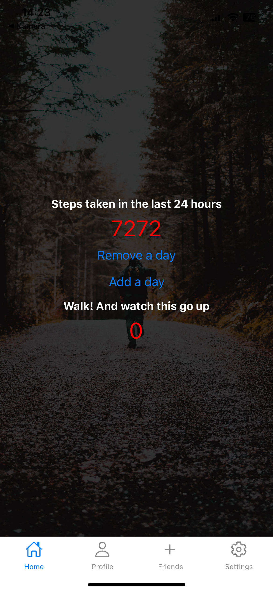
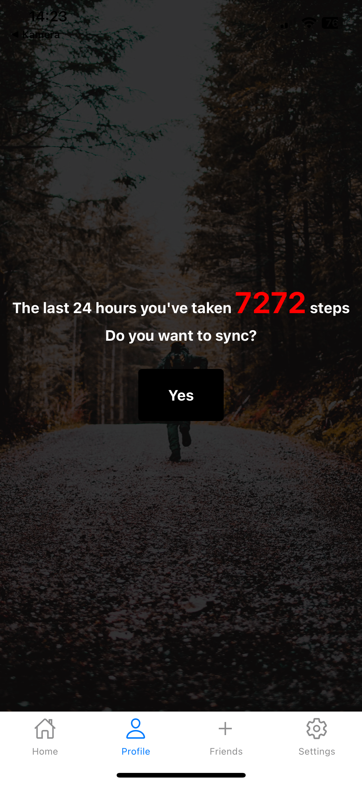
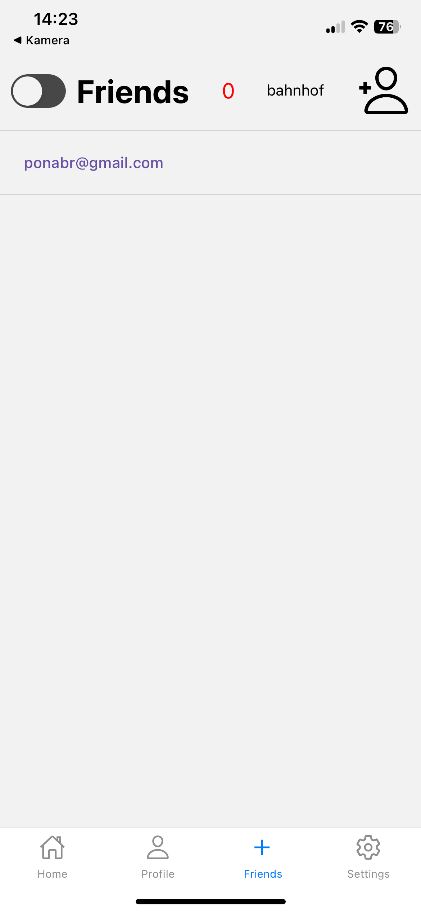
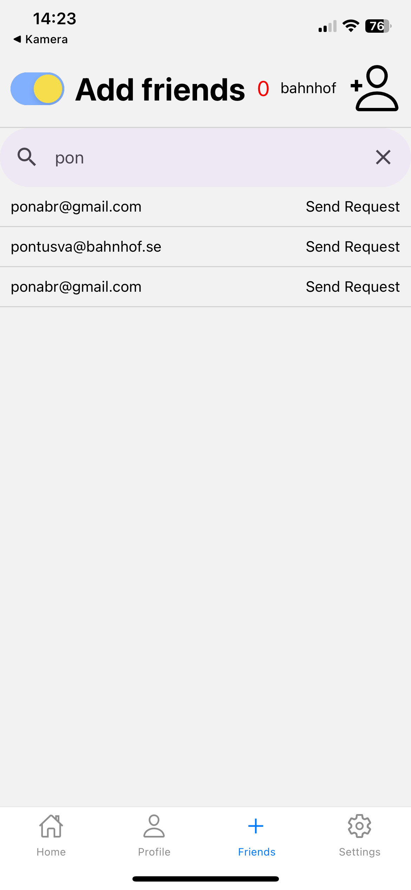

# Step Tracker Test App

This is a test application developed to experiment with and learn about various technologies. It's a React Native application that allows users to track their daily steps and compare them with friends.

## Features

- Track daily steps
- Compare steps with friends
- Send and accept friend requests

## Technologies Used

- Frontend: React Native
- Backend: Node.js with Fastify
- Database: PostgreSQL
- State Management: Zustand
- Linting: ESLint

## Project Structure

The project is divided into two main directories: `app` and `backend`.

- `app`: Contains the React Native application. The main entry point is `App.tsx`. The `screens` directory contains the different screens of the app, and the `components` directory contains reusable components.

- `backend`: Contains the server-side code. The main entry point is `server.ts`. The `routes` directory contains the route handlers, and `db-connection.ts` sets up the connection to the PostgreSQL database.

## View of the app








## Running the App

To run the app, you'll need to start both the frontend and the backend.

For the frontend:

```sh
cd app
npm install
npm start
```

For the backend:

```sh
cd backend
npm install
npm run dev
```

## Disclaimer

This is a test application and is not intended for production use. It's for learning and experimentation purposes only.
